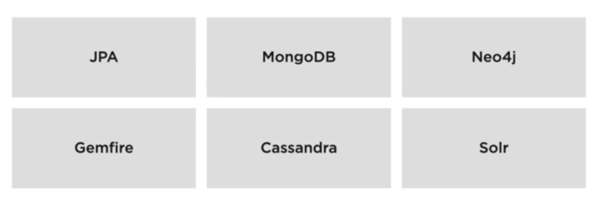

### Spring Data Rest

it can be integrated with many of the persistance protocols.
here example taken is JPA (Spring Data JPA)

Spring data rest sits on the repositories and exposes the Rest End Points
for the methods exposed in the interface.

Rest Levels (Leonard Richardson Pyramid)


* Level 0 : RPC Services without any resources /basic url end points returning Html / XML /Json. No Consideration of resources 
* Level 1: More structure on ur API end Points / URLs. Exposing end Points around Resources (Person / User) 
* Level 2: Exposing Http Verbs for each resource to help scope of interaction with Resources. (PUT / PATCH / DELETE / GET)
* Level 3: Exposing Hypermedia over Level2 along with content (hal+json) exposed with HATEOAS in Spring boot.

Support:

**Spring Data JDBC is not supoorted by Spring Data Rest as it doesnot utilise
the `spring data commons repository` Interface hierarchy**

Supported Eco Systems


Data Jpa \
Mongo Db \
Neo4j \
Gemfire \ 
Cassandra \
Solr

### How Rest End Points are exposed


Spring Data Rest sits on top of repository and exposes rest end point with appropriate Http Verbs
for each method, which can be customised from exporting, the relation (rel) for links, the end point of the method and other things.

Rest Controller is built with Level 2 and 3 (Verbs and HAL - ALPS)

Under Links, 
the rel (relation) for the links for resource under _links
is the plural name of entity

using

```java
import org.springframework.data.jpa.repository.JpaRepository;

// customising name instead of plural name of entity
@RepositoryRestResource (path = "newpath")
public class MyRepo extends JpaRepository<MyEntity, Integer> {}
```

> @RepositoryRestResource(exported = false)
> 
this makes the resource not being exported and also makes all the links related to associations as read only (only Get relartions are exported).

### Working with entities

S is primary key of ticket

Using Links, we can update the attributes with associations.

### Customising payloads
with projections 


they have to be placed in the same package as entities to get automatically picked up (or) can be written other place and manually registered.

Create projections inside `models` package where we have entities.
we add projection annotation to interface,
give name and type as params as shown above. \
Declare the required parameters. (parameters are getters available in actual entity).

when querying the resource, we can give a query param called projection and
give the name of projection as query param.

> http://localhost:6060/api/conference_sessions?projection=sessionDetail

example with above projection involved.

Virtual Projection:
projections should use only entity properties.
we can add @Value and we can change method name for property

```java
@Value("#{target.attributeName}")
String getMyCustomName();

// wtihout value
String getAttributeName();

@Value("#{target.myDemoList.size()}")
Integer getMyListSize();

```
with @Value, we can evaluate expressions also 


**If we want projection to be returned as default, we would use excerpts.**

```java
@RepositoryRestResource(path ="newpath", excerptProjection = ProjectionClassName.class)
public class MyRepo{

}
```

PROS AND CONS


CONS
* Only works with GET, not on PUT / POST 
* Clients can ignore sending the query param for projection, this can be avoided by excerpts.
* cannot be used if we have any service logic.

PROS:
* minimal code to expose an end point
* easily customisable by adding an interface and just adding getters

### HYPERMEDIA


#### HYPERMEDIA COMPONENTS
`HAL (Hypertext Action Language)` \
How Resources are related to other resources within the API.
HAL helps to wrap the links (transition paths) that we can transition from the current resource.


`ALPS (Application Level Profile Semantics)` \
Metadata profile
describes the application semantics.
Tells us about the resource attributes, its related links and their semantics.
ALPS Transistions (bit different from HAL Links) tells us how safe / risky would be a transition would be.
SAFE / UNSAFE / IDEMPOTENT are the levels of safety given with each transition.

`JSON Schema ` \
another metadata profile that helps to understand about API.
This is a blueprint of the API.
JSON schema tells about the data types of the fields (modal attributes).
eg: POST Request body for a new api -> Data types helps us.

if we hit the resource base url,
we get HAL with the content (data) and links and page(paging info).\
To get ALPS, under links, we can go to profile to access it.
This lists the parameters of the entity, and then the end points along with the safety levels (Safe / unsafe/ Idempotent).

With the DELETE / UPDATE, we don't know how to call them.
what is the url and what should we pass as body.

For JSON Schema,
under main profile, we can add the Header
> Accept: application/schema+json

with this,we get the payload with all model attributes and operations with the dataTypes.

### Validation for APIs.
Add constraints to models.
@NotNull, @Size, etc.,

or use Lifecycle events to handle this, like\
BeforeCreateEvent \
BeforeSaveEvent  
BeforeLinkSaveEvent \
BeforeDeleteEvent \
AfterCreateEvent
*same with After for other events.

```xml
spring-boot-starter-validation
```

ControllerAdvice is used to handle the exceptions
@ExceptionHandler - to tell what exception is handled.
@ResponseStatus - to give the status code for response.

using RepositoryEventHandlers
